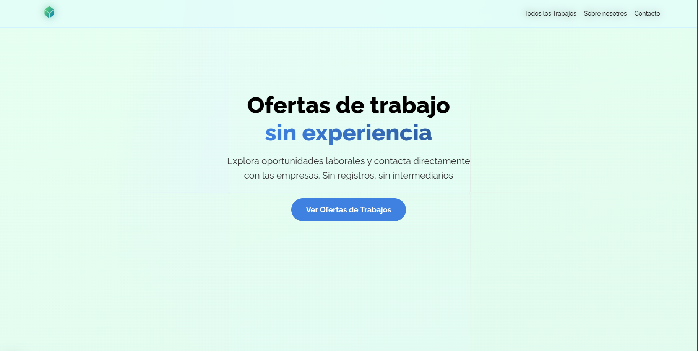

# Plataforma de Trabajo

> [!NOTE]
> Proyecto en construcción

Una plataforma para conseguir trabajo que abarca distintos tipos de rubros en distintas partes de Argentina. Sin necesidad de registrarte, solamente envía tu CV a la empresa que te interesa.

## Herramientas utilizadas

- [Next.js](https://nextjs.org/)
- [React](https://reactjs.org/)
- [GraphQL](https://graphql.org/)
- [GraphQL Codegen](https://graphql-code-generator.com/)
- [WordPress](https://wordpress.org/)
- [WPGraphQL](https://wpgraphql.com/)
- [ACF](https://www.advancedcustomfields.com/)
- [Typescript](https://www.typescriptlang.org/)
- [Penpot](https://penpot.app/)

## Contacto

Si tienes alguna duda o sugerencia, no dudes en contactarme

- 👤 [Elias Pereyra](https://github.com/EliasPereyra)
- 📬 [Email](mailto:eliaspereyra_gomez@hotmail.com)
- 🔗 [Linkedin](https://www.linkedin.com/in/elias-pereyra-gomez/)
- 🔗 [Website](http://eliaspereyra.netlify.app)
