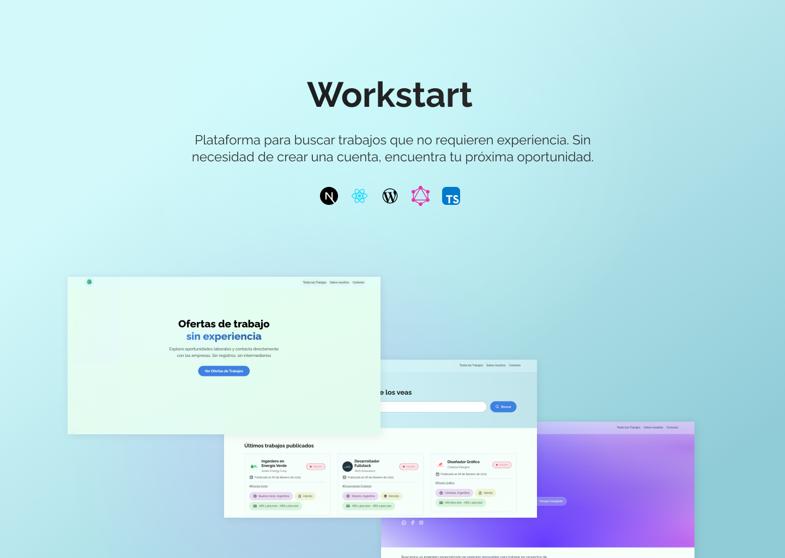

# WorkStart · Plataforma de empleo sin experiencia



Bolsa de empleo con ofertas que piden poca o ninguna experiencia, pensada para Argentina. La idea es bajar la barrera de entrada al primer trabajo: cada oferta muestra toda la información del puesto y el contacto directo de la empresa, sin intermediarios.

## Estructura

El repo es un monorepo con [pnpm workspaces](https://pnpm.io/workspaces); la web es un monolito modular dentro de él:

```
.
├── web/                      App Next.js (App Router), organizada como monolito modular
│   ├── app/                  Rutas
│   ├── modules/              Módulos de dominio (jobs, layout, pages, cms)
│   ├── shared/               Código compartido entre módulos (íconos, loader, utilidades)
│   └── styles/               Design tokens y estilos globales
├── studio/                   Sanity Studio: schemas, estructura, seed de datos
├── packages/
│   ├── cms-sanity/           Capa de datos de Sanity: client, Live Content API, queries GROQ, tipos (TypeGen)
│   └── cms-wordpress/        Capa de datos de WordPress (pausada, ver docs/wordpress.md)
└── docs/                     Documentación de referencia
```

La web solo habla con el CMS a través de `web/modules/cms`. Para probar otro CMS basta con crear un paquete en `packages/` que exponga las mismas funciones (`getJobsPage`, `getJob`, `getCompany`, …) y apuntar ese módulo a él.

## Herramientas

- ![Next.js][Next.js]
- ![React][React]
- ![Sanity][Sanity]
- ![Typescript][Typescript]
- ![Vitest][Vitest]
- ![Figma][Figma]

## Primeros pasos

Requisitos: Node 20+ y pnpm 12.

```bash
pnpm install
cp web/.env.example web/.env.local   # completa las variables si usas otro proyecto de Sanity
pnpm dev                              # web en :3000 y Studio en :3333
```

| Comando | Qué hace |
| --- | --- |
| `pnpm dev` | Levanta la web y el Studio en paralelo (`dev:web` / `dev:studio` para uno solo) |
| `pnpm build` | Build de producción de la web |
| `pnpm test` / `pnpm lint` | Tests (Vitest) y lint de la web |
| `pnpm typegen` | Extrae el schema y regenera `packages/cms-sanity/src/sanity.types.ts` |
| `pnpm seed` | Carga datos de prueba en el dataset (requiere `npx sanity login`) |

## Sanity

- **Proyecto:** `swb3duug`, dataset `production` (público).
- **Studio:** `studio/`, standalone. Los schemas replican el modelo que se usaba en WordPress: `job`, `company`, `jobCategory`, `siteSettings` (singleton) y el objeto `seo`.
- **Datos:** `web` lee con `defineLive` de `next-sanity`, así que los cambios publicados se ven sin redeploy.
- **Draft mode / Visual Editing:** la herramienta Presentation del Studio abre la web en `/api/draft-mode/enable`. Requiere `SANITY_API_READ_TOKEN` (token Viewer) en `web/.env.local`.
- **Tipos:** las queries GROQ viven en `packages/cms-sanity/src/queries.ts`; después de cambiarlas (o de cambiar un schema) corre `pnpm typegen`.
- **CORS:** `http://localhost:3000` y `http://localhost:3333` ya están habilitados. Para producción agrega el dominio con `npx sanity cors add <url> --credentials`.

### Datos de prueba

`pnpm seed` crea categorías, 9 compañías ficticias y 18 ofertas inspiradas en puestos típicos de primer empleo (repositor, cajero, operario de depósito, atención telefónica, etc.). Las imágenes son fotos gratuitas de Unsplash usadas como logos temporales, y los emails usan el dominio reservado `.example`. El script es idempotente: si un documento con el mismo slug ya existe, lo reutiliza.

## WordPress

La primera versión usaba WordPress (WPGraphQL + ACF + Yoast). Está pausada, no eliminada: el código está en [`packages/cms-wordpress`](packages/cms-wordpress) y la configuración en [`docs/wordpress.md`](docs/wordpress.md).

## Contacto

- 👤 [Elias Pereyra](https://github.com/EliasPereyra)
- 📬 [Email](mailto:eliaspereyra_gomez@hotmail.com)
- 🔗 [Linkedin](https://www.linkedin.com/in/elias-pereyra-gomez/)
- 🔗 [Website](http://eliaspereyra.netlify.app)

[Next.js]: https://img.shields.io/badge/Next.js-000000?style=for-the-badge&logo=nextdotjs&logoColor=white
[React]: https://img.shields.io/badge/React-20232A?style=for-the-badge&logo=react&logoColor=61DAFB
[Sanity]: https://img.shields.io/badge/Sanity-F03E2F?style=for-the-badge&logo=sanity&logoColor=white
[Typescript]: https://img.shields.io/badge/TypeScript-007ACC?style=for-the-badge&logo=typescript&logoColor=white
[Figma]: https://img.shields.io/badge/Figma-F24E1E?style=for-the-badge&logo=figma&logoColor=white
[Vitest]: https://img.shields.io/badge/Vitest-6E9F18?style=for-the-badge&logo=vitest&logoColor=white
